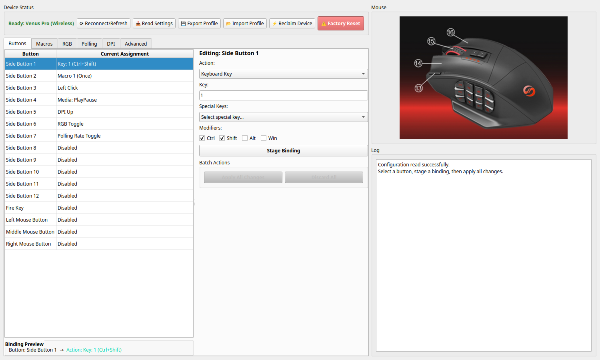
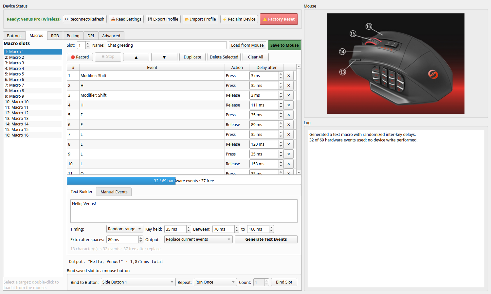
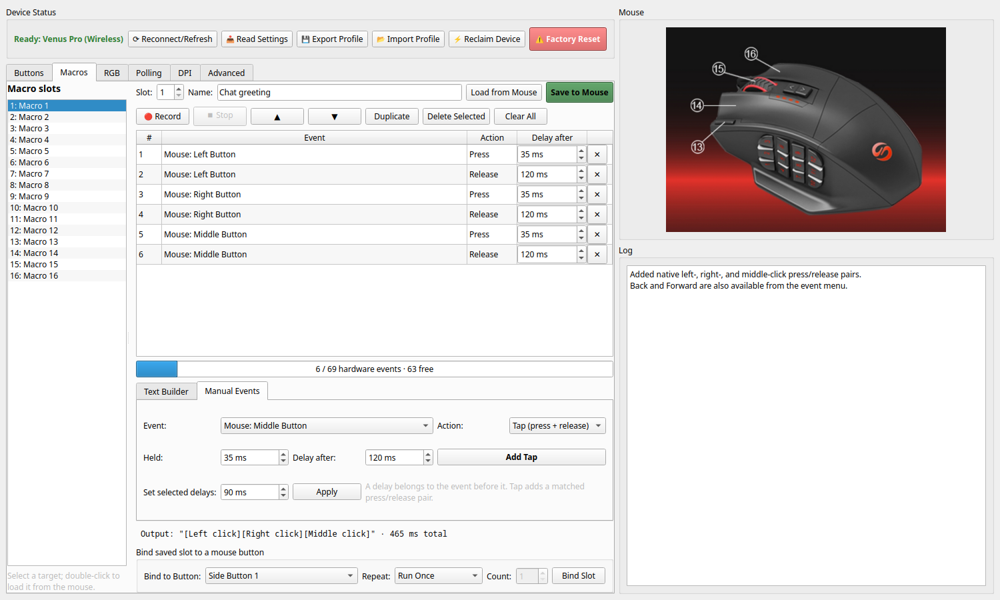
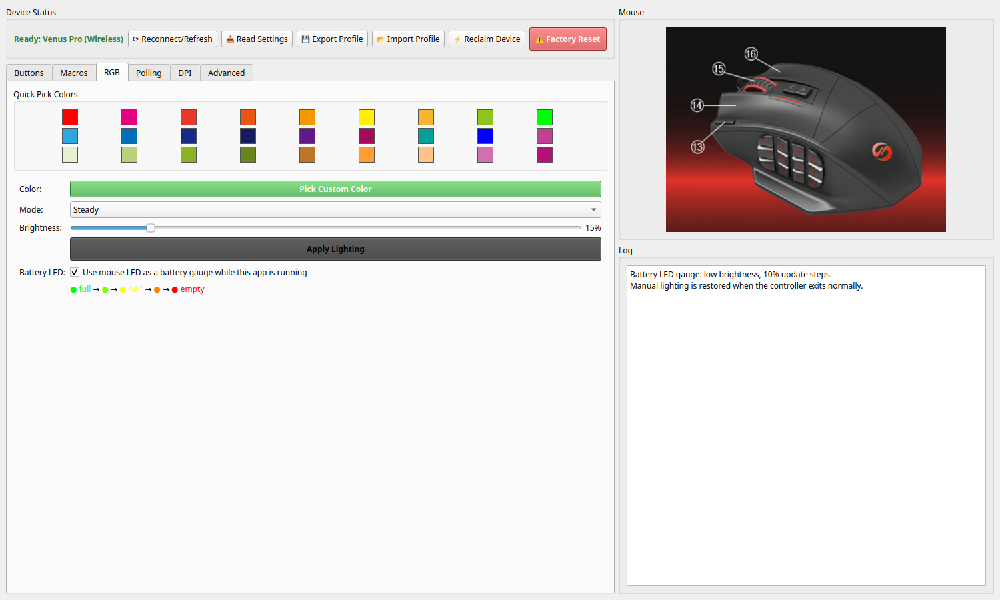
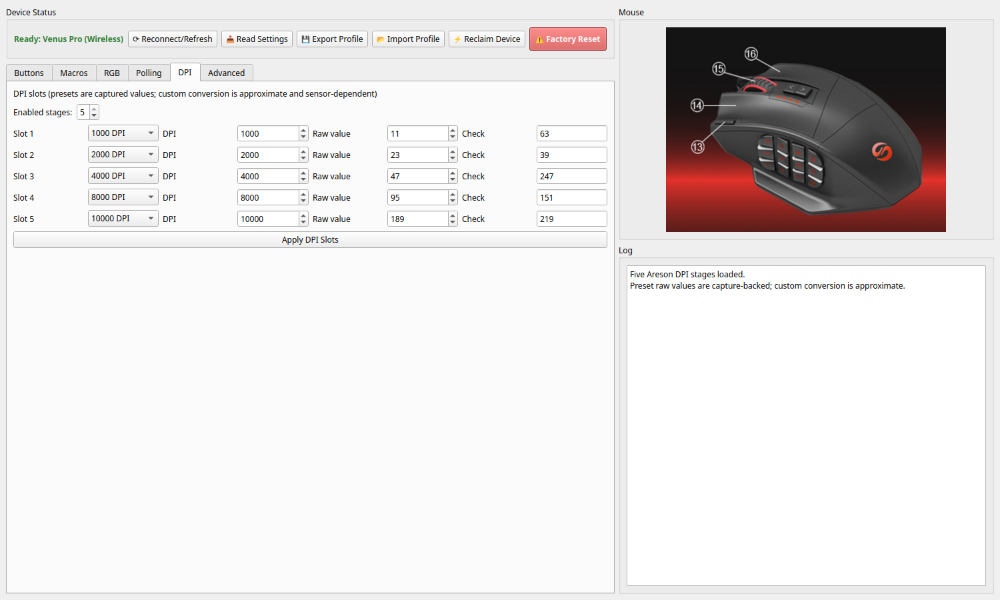
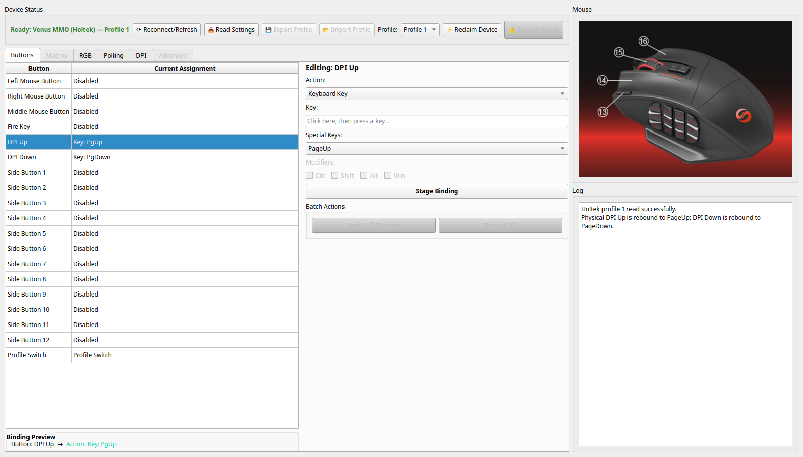
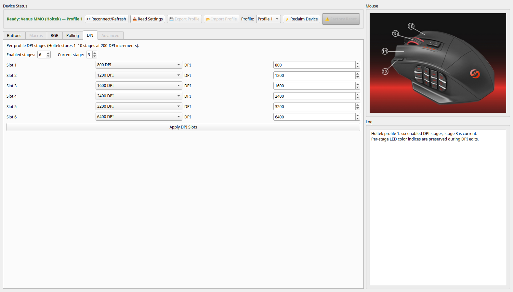

# Venus Pro Config (Linux)

[](LICENSE)


A reverse-engineered Linux configuration utility for the UtechSmart Venus Pro MMO gaming mouse.

It gives Linux users a practical way to manage bindings, macros, DPI profiles, polling rate, and RGB lighting without relying on the vendor's Windows-only software.

## Quickstart

### Release packages

Download the package for your distribution from the
[latest GitHub release](https://github.com/Es00bac/UtechSmart-Venus-Pro-Linux-MMO-Mouse-Utility/releases/latest):

| Distribution | Artifact | Install command | Runtime dependencies |
|---|---|---|---|
| Debian 12+/Ubuntu 24.04+ | `.deb` | `sudo apt install ./venusprolinux_*_all.deb` | `python3`, `python3-pyqt6`, `python3-hid` |
| Fedora 43+ | `.rpm` | `sudo dnf install ./venusprolinux-*.rpm` | `python3`, `python3-pyqt6`, `python3-hidapi` |
| Arch Linux | `.pkg.tar.zst` | `sudo pacman -U ./venusprolinux-*.pkg.tar.zst` | `python`, `python-pyqt6`, `python-hidapi` |
| Cross-distribution | `.flatpak` | `flatpak install --user ./VenusProLinux-*.flatpak` | Bundled in the Flatpak |
| Cross-distribution x86_64 | `.AppImage` | `chmod +x ./VenusProLinux-*.AppImage && ./VenusProLinux-*.AppImage` | Python, PyQt6, and hidapi bundled; system `libGL` |

The native packages install the udev access rule automatically. Flatpak and
AppImage cannot install host udev rules. Download and install the reviewed
v0.3.0 rule once, then reconnect the mouse or receiver:

```bash
curl -LO https://raw.githubusercontent.com/Es00bac/UtechSmart-Venus-Pro-Linux-MMO-Mouse-Utility/v0.3.0/packaging/linux/99-venus-pro.rules
sudo install -Dm644 99-venus-pro.rules /etc/udev/rules.d/99-venus-pro.rules
sudo udevadm control --reload-rules
```

Run the Flatpak with:

```bash
flatpak run com.github.es00bac.venusprolinux
```

### Arch Linux (AUR)

```bash
yay -S venusprolinux-git
```

The repository now contains a complete VCS `PKGBUILD`; it uses Arch's
`python-pyqt6` and `python-hidapi` packages and does not build Python packages
with pip.

### Arch Linux (manual)

Install the Python packages with pacman first. `cython` is included here for
people who also experiment with the PyPI hidapi build; the packaged runtime
does not otherwise need a compiler.

```bash
sudo pacman -S --needed cython python-pyqt6 python-hidapi
git clone https://github.com/Es00bac/UtechSmart-Venus-Pro-Linux-MMO-Mouse-Utility.git
cd UtechSmart-Venus-Pro-Linux-MMO-Mouse-Utility
./install.sh
```

### Other distributions (manual)

```bash
git clone https://github.com/Es00bac/UtechSmart-Venus-Pro-Linux-MMO-Mouse-Utility.git
cd UtechSmart-Venus-Pro-Linux-MMO-Mouse-Utility
python3 -m pip install --user hidapi PyQt6
./install.sh
```

Then launch:

```bash
venusprolinux
```

Or run directly from source:

```bash
python3 venus_gui.py
```

## Project status

- Built from reverse-engineered HID protocol work, not vendor documentation.
- Intended for real Linux-side configuration of the Venus Pro family.
- Focused on device configuration, not on replacing the kernel input stack or becoming a full driver daemon.

## Supported device targets

The current repo and udev guidance target these USB IDs:

- `25a7:fa07`
- `25a7:fa08`
- `04d9:fc55`

If your device reports a different ID, verify support before assuming compatibility.

## Features

- **Button Remapping:** Configure 16 Areson controls or all 19 mapped Holtek
  controls, including the 12-button side panel.
- **Modifier Support:** On Areson, bind or record combinations such as
  `Ctrl+Shift+1`, `Alt+F1`, and `Ctrl+Alt+Delete`; hardware macros preserve
  modifier press/release order and left/right identity where the protocol does.
- **Macro Engine:** Slot-oriented editor with recording, reordering, duplication,
  exact capacity feedback, and fixed or randomized timing.
- **Text Macros:** Convert US-layout text with separate key-hold, inter-key,
  random-range, and extra word-pause controls.
- **Mouse Macro Events:** Add native left, right, middle, back, and forward taps
  or individual press/release events.
- **Battery Tray Icon:** Shows battery level and cable state through Qt's desktop tray API.
- **Battery-color Mouse LED:** Optional low-brightness green → yellow →
  orange → red gauge, controlled by the app while it remains in the tray.
- **RGB Lighting:** Full control over LED color, brightness, animation speed,
  and Steady, Breathing, Neon, or Off effects.
- **DPI Profiles:** Configure 1–5 enabled Areson stages or 1–10 per-profile
  Holtek stages, including the Holtek current stage.
- **Controller-aware UI:** Shows only actions the connected Areson or Holtek
  controller can encode; confirmed Holtek Profile Switch and physical DPI
  button rebinding are exposed directly.
- **Polling Rate:** Adjust USB polling rate between 125Hz and 1000Hz.
- **Factory Reset:** Restore Areson devices to their original state when
  troubleshooting or unwinding experiments.

## Screenshots

### Buttons tab

Configure every mapped Areson button with keyboard keys, mouse actions, macros,
media keys, DPI control, and repeated-click actions. The list adapts when a
Holtek device is connected.



### Macros tab

Build text with fixed or randomized inter-key delays, append or replace events,
record keyboard shortcuts with Ctrl/Shift/Alt/GUI, reorder steps, and see the
exact 69-event hardware capacity before saving. See the
[macro editor guide](docs/MACRO_EDITOR.md) for timing semantics and hardware
limits.



The manual builder creates matched mouse taps or individual press/release
events and can bulk-edit selected delays.



### RGB tab

Control LED color, brightness, effect mode, and the captured five-step
animation speed for Breathing or Neon.

- **Off** — disable the LED
- **Steady** — solid color at adjustable brightness
- **Neon** — color cycling effect
- **Breathing** — pulsing fade effect



### DPI tab

Choose how many DPI stages are enabled and configure their values. The Areson
model exposes five user-facing stages; Holtek profiles support up to ten at
200-DPI increments and retain their current-stage and color-index metadata.



### Holtek wired variant

The Holtek-aware Buttons page exposes its physical DPI Up, DPI Down, and
Profile Switch controls. Unsupported Areson-only actions and raw-report tabs
are disabled instead of being sent through the wrong protocol.



Holtek profiles can use 1–10 DPI stages and select the stage that becomes
current after applying the profile.



### Polling tab

Adjust the USB polling rate:

- **125Hz** — lowest CPU usage
- **250Hz**
- **500Hz**
- **1000Hz** — best responsiveness for gaming

### Advanced tab

Areson-only diagnostic tools for building or sending raw 17-byte HID reports.

## Requirements

- **Python 3.10+**
- **hidapi**
- **PyQt6**

Optional dependencies:

- **python-pyusb** — advanced device management

## Installation notes

### Non-root access with udev

The installer and packages install `packaging/linux/99-venus-pro.rules`. For a
source checkout, install that same reviewed file and reconnect the device:

```bash
sudo install -Dm644 packaging/linux/99-venus-pro.rules /etc/udev/rules.d/99-venus-pro.rules
sudo udevadm control --reload-rules
sudo udevadm trigger --subsystem-match=hidraw
```

The rules cover both the `hidraw` node used by hidapi and the USB device node
used by optional diagnostics. They use desktop-session ACLs (`TAG+="uaccess"`)
with mode `0660`, rather than leaving the mouse world-writable.

### “Mouse detected, but open failed”

The Areson/Compx models expose multiple HID interfaces. Configuration is on
interface 1; interface 0 is the boot mouse and cannot accept these feature
reports. The app now selects the vendor interface explicitly. If it reports an
access error after installation:

1. Unplug and reconnect the mouse or wireless receiver.
2. Confirm that `ls -l /dev/hidraw*` shows an ACL (`+`) for your desktop user.
3. Close the Windows utility, Wine, virtual machines, and USB capture tools
   that may have claimed the device, then click **Reconnect/Refresh**.

For a read-only interface/access diagnostic (and optional battery query), run:

```bash
python3 tools/diagnose_device.py --battery
```

The wired `25a7:fa08`, wireless receiver `25a7:fa07`, and Holtek `04d9:fc55`
variants use different interface selection where needed.

### Battery tray compatibility

The tray icon uses Qt `QSystemTrayIcon`, so it works with KDE Plasma, XFCE,
MATE, and other desktops that expose a StatusNotifier/system tray. GNOME Shell
normally requires its AppIndicator/KStatusNotifier extension. If the desktop
does not expose a tray, the main configuration window still works normally.

The RGB tab and tray menu both expose **Battery-color mouse LED**. This mode
uses the capture-confirmed 10% steady-light setting, checks the battery once
per minute, and writes a new color only when the hardware's 10% battery step
changes. The absolute raw minimum is avoided because the physical LED's green
channel overwhelms red there, making yellow and orange appear green. Closing
the window keeps the controller active in the tray; quitting the app restores
the lighting that was active when the mode was enabled. The preference is
remembered for the next launch.

This is intentionally a user-session background controller rather than a root
daemon: it shares the same hidraw/uaccess permissions as the GUI and can own a
desktop tray icon. On desktops without a tray, the feature continues only
while the main window remains open.

## Usage

Typical flow:

1. Click **Read Settings** to load the current device state.
2. Use the **Buttons** tab to choose a button and set an action.
3. Click **Stage Binding** or rely on changes being staged as you edit.
4. Click **Apply All Changes** to write staged bindings to the device.
5. Use the **Macros** tab to record or build a macro, then click **Save to Mouse**.
6. Bind the saved slot with **Bind Slot**.

Practical notes:

- **Wired and wireless:** the app uses the wired connection when present and falls back to the wireless receiver when USB is disconnected.
- **Battery:** command `0x04` reports 0–10 battery steps and whether the cable is connected; it is a status query, not a write commit.
- **Battery LED:** enable it in the RGB tab or tray menu, then close the window
  to leave the lightweight controller running in the desktop session.
- **Factory reset:** the red device-status action restores Areson defaults, but
  it also wipes custom macros.
- **Read first:** when troubleshooting, start by reading the current device state before staging new writes.
- **Random text timing:** random gaps are sampled when events are generated and
  then stored as ordinary fixed delays in the hardware slot.

## Known limitations

- This project is based on reverse-engineered device behavior, so unsupported firmware or hardware variants may diverge.
- The repo is focused on the Venus Pro family rather than generic MMO mouse support.
- The `25a7:fa07/fa08` action table contains the 12 side buttons, fire, and the
  three primary mouse buttons, but no entries for its physical top DPI buttons;
  those appear firmware-fixed. The Holtek `04d9:fc55` map does expose DPI Up and
  DPI Down, so those two buttons can be rebound on that variant.
- Mouse movement is not accepted by the vendor macro converter. Native macro
  clicks are supported; relative pointer movement is not currently offered.
- Hardware macros are confirmed only for the Areson `25a7:fa07/fa08` family.
  The Macros tab is disabled for the Holtek controller rather than guessing at
  an incompatible storage format.
- Holtek keyboard-button records contain one HID usage and no modifier field;
  the UI disables modifier checkboxes for that controller.
- The Areson lighting command is an EEPROM write rather than a known volatile
  LED command. Battery LED mode therefore writes only on a reported 10% step
  change and restores the prior lighting on normal application exit.
- The wireless mouse firmware can turn RGB off after inactivity even when a
  steady color is stored. Neither the vendor UI nor the reverse-engineered
  configuration exposes an always-on/idle-time field. The battery controller
  deliberately avoids periodic EEPROM writes as an LED keepalive.

## Development

Useful repo entry points if you want to inspect or extend the protocol work:

- `PROTOCOL.md`: current USB HID protocol specification
- `old_stuff/win.md`: archived notes on the Windows utility behavior
- `venus_protocol.py`: core protocol implementation
- `holtek_protocol.py`: Holtek profile, button, DPI, lighting, and polling protocol
- `staging_manager.py`: change staging system
- `transaction_controller.py`: HID transaction handling
- `docs/MACRO_EDITOR.md`: macro workflows, timing semantics, and limits

Run the capture-backed, hardware-safe regression set explicitly:

```bash
python3 -m unittest \
  tests.test_areson_protocol_offline tests.test_holtek_protocol_offline \
  tests.test_battery_led_gui tests.test_macro_editor \
  tests.test_protocol tests.test_rgb tests.test_staging \
  tests.test_atomic_controller tests.test_error_recovery
```

Regenerate the README screenshots without opening a HID device:

```bash
QT_QPA_PLATFORM=offscreen python3 tools/capture_ui_screenshots.py
```

The renderer uses illustrative configuration values and never writes to a
mouse.

Do not treat unrestricted test discovery as hardware-safe. Several older
files under `tests/` and `tools/` are preserved exploratory/replay programs;
some write EEPROM, replay superseded packet guesses, or issue factory reset.
The maintained utility, protocol module, decoder, diagnostic, and explicit
offline suite above are the authoritative paths.

## Release checklist

- Verify the screenshots still match the current UI.
- Confirm the documented USB IDs still match supported hardware paths.
- Re-test button staging, macro upload, DPI writes, polling writes, and factory reset on actual hardware.
- Re-read the udev guidance after any access-model changes.
- Make sure debug artifacts or protocol captures are not accidentally staged.

## Acknowledgments

This utility exists because the mouse is useful on Linux but the vendor stack is not. The project was built through careful inspection of USB protocol behavior to reproduce the practical parts of the Windows configuration flow.
